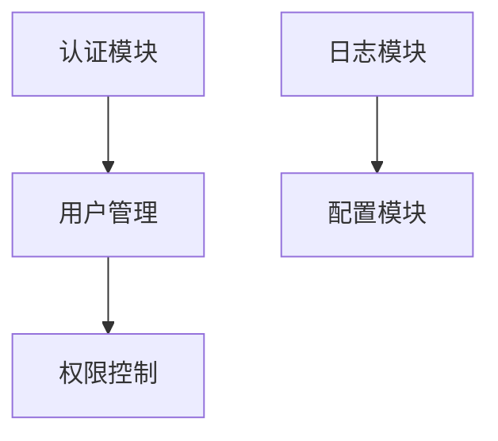

# 知识目录

<!-- 
Global dependency graph showing relationships between all subjects.
Dependency sources:
  1. Markdown link references between files
  2. Conceptual dependencies inferred by LLM content analysis
Constraints:
  - Maximum 4 dependency levels (merge subjects if exceeded while preserving semantics)
  - Subjects must be concrete entities documented in source files, not abstract concepts
Format: graph TD for top-down directed graph, --> shows dependency direction
-->
## 全局依赖图

<!-- 
Subject list: Subjects identified from scanning all .md files.
Each subject contains:
  - Subject name: Level 3 heading (###)
  - Introduction: 50-150 character description explaining purpose and problem solved
  - Source: Relative path to the source file (relative to target directory)
Format: Each subject as independent section, ordered alphabetically or by dependency
Constraints:
  - Subjects must be concrete physical entities documented in source files
  - Not abstract concepts
  - ONE subject per file only
  - Source path must be relative to the target directory
-->
## 主体列表

### 认证模块
- 介绍：本模块提供用户身份认证功能，支持 JWT 令牌生成与验证、密码加密存储、会话管理等功能。解决用户登录认证、权限校验等问题，是系统中所有需要用户身份识别功能的基础依赖。
- 来源：`modules/auth/README.md`

### 用户管理
- 介绍：本模块提供用户 CRUD 操作、用户信息查询、用户状态管理等功能。解决系统中用户数据的增删改查需求，依赖于认证模块进行身份验证。
- 来源：`modules/user/README.md`